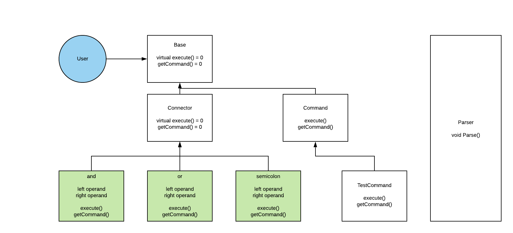

# CS 100 Programming Project

<p>Authors: Rajbir Johar</p>

# Introduction
<p>This program is aimed to replicate the standard functions of a shell using Command Line Interface (CLI) which will be written primarily in C++. We plan to implement the basic logic operators such as `&&`, `||`, `;` as well as standard commands such as `echo`.We also want to allow for multiple commands to be run all at once.</p>

# Steps for Installation

## Basic Requirements

* You must have a terminal or shell capable of running C++11.
* You must have a minimum cmake version of 3.14.

## Steps

* Clone this repository into a local folder.
* Run these commands in order:

`git submodule init`

`git submodule update`

`cmake .`

`make`

`./rhoshell`

# Diagram



# Classes

* `parse()` - Accepts user input in which it will be split and sorted into its respective functions.

## Base

<p>Base holds the virtual functions.</p>

* `virtual execute() = 0` - requires subclasses to implement this function
* `virtual getCommand() = 0`

## Connector Class

* `Left and Right` - stores the commands that need to be connected.
* `execute()`

## Command Class

<p>The command function accepts a string parameter.</p>

## "And" Class
Also known as the `&&` . The second command will execute only if the first command executes.

* `execute()`
* `getCommand()` - returns && for testing

## "Or" Class

Also known as the `||` . The second command will execute if the first one fails
to execute.

* `execute()`
* `getCommand()` - returns || for testing

## "Semicolon" Class

Also known as the `;` . Used to separate instructions.

* `execute()`
* `getCommand()` - returns ; for testing

## "TestCommand" Class

Tests to see if the file path exists

* `execute()`
* `getCommand()` - returns command(test) for testing

# Prototypes/Research

```cpp
#include <sys/types.h>
#include <sys/wait.h>
#include <unistd.h>
#include <stdio.h>

int main(){
    pid_t child;
    int ChildStatus;

    child = fork();

    if(child == 0){
        execvp(argv[0], argv);
        cout << "No value was entered." << endl;
    }
    else{
        pid_t waitChild = wait(&childStatus);
        return childStatus;
    }
}
void parser(char ln, char **argv){
    while(ln != '\0'){
        **argv++ ln;
        while(ln != ' '&& ln != '\n'){
            ln++;
        }
    }
}
```

<p>The fork() functions creates a new process(it can be used to create child
process). The execvp() over writes the program with a new program. The waitpid()
waits for the child process to end and join the master. The parser breaks the
lines into smaller pieces. These functions will be used when waiting for other
commands to finish. </p>

# Development and Testing Roadmap

1. Understand the the entire project along with individual tasks thoroughly
   before attempting any design.
2. Select the design pattern appropiate for our project and create a framework
   for the classes that we intend to implement.
3. Begin implementation of classes and core functions while understanding how
   the design pattern works.
4. Test individual functions.
5. Test compatibility of functions.
6. Squeeze out any bugs present during testing.
7. More testing to ensure all functions work as intended.
